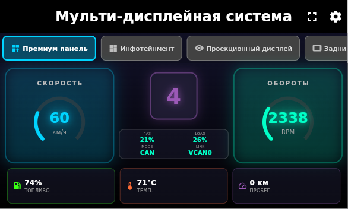
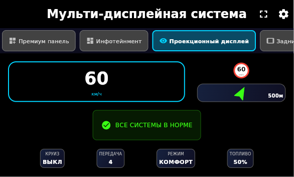

# Flutter Automotive Dashboard - Мульти-дисплейная система

## Обзор проекта

Полнофункциональная мульти-дисплейная автомобильная система для Raspberry Pi с поддержкой flutter-pi. Проект демонстрирует современные подходы к разработке автомобильных интерфейсов с красивым неоновым дизайном, симулятором данных и оптимизацией для экрана 800x480.

## 📸 Скриншоты

### Основная приборная панель


### Мультидисплейная система  


## 🚗 Основные функции

### 1. Мульти-дисплейная система
- **Приборная панель** с неоновым дизайном и круговыми индикаторами
- **Инфотейнмент дисплей** для мультимедиа и навигации
- **Проекционный дисплей (HUD)** для критически важной информации
- **Задние дисплеи** для развлечения пассажиров
- **Гибкое управление** дисплеями с настройкой яркости и поворота
- **Режим зеркалирования** и синхронизации между дисплеями
- **Полноэкранный режим** для каждого дисплея

### 2. Приборная панель с неоновым дизайном
- **Спидометр** с круговым индикатором и неоновой подсветкой (#00D4FF)
- **Тахометр** с динамической подсветкой и красной зоной опасности
- **Индикатор передачи** в центре с фиолетовой подсветкой (#B366FF)
- **Информационная панель** с показателями двигателя (газ, нагрузка, режим)
- **Нижние индикаторы**: топливо, температура двигателя, пробег
- **Интеграция с музыкальным плеером** с кнопкой управления
- **Адаптивный дизайн** для экрана 800x480

### 3. Симулятор автомобильных данных
- **Реалистичные показания** спидометра, тахометра, уровня топлива
- **Температурные датчики** двигателя с предупреждениями
- **CAN Bus симулятор** для демонстрации OBD-II данных
- **Переключение между режимами** (симулятор/реальные данные)
- **Плавные анимации** изменения показателей

### 4. Аудиосистема
- **Интеграция с медиаплеером** через кнопку на панели
- **Управление воспроизведением** музыки
- **Индикация состояния** (играет/остановлено/загрузка)
- **Поддержка различных аудиоформатов**

### 5. Flutter-pi интеграция для Raspberry Pi
- **Запуск без X11** на встроенных системах
- **Оптимизация производительности** для ARM процессоров
- **Поддержка тачскрина** на малых экранах
- **Автоматическая адаптация интерфейса** под размер экрана

## 📁 Структура проекта

```
dashboard/
├── lib/
│   ├── main.dart                           # Основная точка входа (мульти-дисплей)
│   ├── main_dashboard.dart                 # Точка входа для панели
│   ├── main_media.dart                     # Точка входа для медиаплеера
│   ├── core/
│   │   └── theme/
│   │       └── automotive_theme.dart       # Неоновая тема киберпанк
│   ├── services/
│   │   ├── can_bus_service.dart            # CAN Bus сервис
│   │   ├── audio_service.dart              # Аудио сервис
│   │   ├── display_manager.dart            # Управление дисплеями
│   │   └── physics_simulation.dart         # Физическое моделирование
│   ├── models/
│   │   └── vehicle_data.dart               # Модели данных автомобиля
│   ├── widgets/
│   │   └── error_boundary.dart             # Обработка ошибок
│   └── apps/
│       ├── dashboard/                      # Приборные панели
│       │   ├── medium_dashboard.dart       # Основная анимированная панель
│       │   ├── simple_dashboard.dart       # Упрощенная панель
│       │   └── widgets/                    # Виджеты приборов
│       ├── media/                          # Медиаплеер
│       │   └── car_media_player.dart       # Автомобильный плеер
│       ├── multi_display/                  # Мульти-дисплейная система
│       │   ├── multi_display_app.dart      # Основное приложение
│       │   └── widgets/                    # Компоненты дисплеев
│       │       ├── heads_up_display.dart
│       │       ├── infotainment_display.dart
│       │       ├── rear_passenger_display.dart
│       │       └── display_configuration_panel.dart
│       └── multimedia/                     # Мультимедиа система
│           ├── multimedia_app.dart
│           └── widgets/
├── test/                                  # Тесты
│   ├── unit/
│   ├── widget/
│   └── integration/
├── assets/                                # Ресурсы (шрифты, иконки, аудио)
└── pubspec.yaml                           # Зависимости проекта

python_can_simulator/                      # Python симулятор CAN
├── can_simulator.py                      # Генератор данных

flutter-pi-src/                           # Исходники flutter-pi
├── src/                                  # C/C++ код
└── plugins/                              # Плагины для автомобильных функций
```

## 🏗️ Архитектурные особенности

### Управление состоянием
- **Riverpod** для реактивного управления состоянием
- **StateNotifier** для сложной логики (аудио, дисплеи, CAN bus)
- **Provider** для простых состояний и зависимостей

### Производительность
- **Оптимизированная анимация** с `SingleTickerProviderStateMixin`
- **Кастомные CustomPainter** для сложных UI элементов
- **Эффективное обновление данных** через Stream и Timer
- **Ленивая загрузка** компонентов

### Адаптивность
- **Отзывчивый дизайн** для различных разрешений экранов
- **Масштабируемые виджеты** с использованием Flex и Expanded
- **Адаптация под различные форм-факторы** (приборы, инфотейнмент, HUD)

## 🛠️ Технические детали

### Мульти-дисплейная архитектура
```dart
// Управление дисплеями через DisplayManager
class DisplayManager extends StateNotifier<DisplaySystemState> {
  void initialize(List<DisplayInfo> displays) {
    // Инициализация конфигураций для каждого дисплея
    final configurations = <String, DisplayConfiguration>{};
    for (final display in displays) {
      configurations[display.id] = DisplayConfiguration(
        displayId: display.id,
        brightness: _getDefaultBrightness(display.type),
        rotation: 0,
        isActive: true,
      );
    }
  }

  // Управление яркостью всех дисплеев
  void syncAllDisplays() {
    final primaryConfig = state.primaryDisplayId != null 
        ? state.configurations[state.primaryDisplayId!]
        : null;
    // Синхронизация настроек со всеми дисплеями
  }
}

// Типы дисплеев в системе
enum DisplayType {
  mediumDashboard,  // Анимированная приборная панель
  infotainment,     // Инфотейнмент система
  headsUp,          // Проекционный дисплей
  rearPassenger,    // Задние дисплеи
}
```

### Приборная панель с круговыми индикаторами
```dart
class SimpleGaugePainter extends CustomPainter {
  final double value;
  final Color color;
  
  @override
  void paint(Canvas canvas, Size size) {
    final center = Offset(size.width / 2, size.height / 2);
    final radius = math.min(size.width, size.height) / 2;
    
    // Рисование кругового индикатора с неоновым эффектом
    canvas.drawArc(
      Rect.fromCircle(center: center, radius: radius - 10),
      -math.pi * 1.25,
      math.pi * 1.5 * value,
      false,
      Paint()
        ..style = PaintingStyle.stroke
        ..strokeWidth = 6
        ..color = color,
    );
  }
}

// Интеграция аудиосистемы в приборную панель
Widget _buildMusicButton(WidgetRef ref) {
  final audioState = ref.watch(audioServiceProvider);
  // Кнопка управления музыкой прямо на панели приборов
  return GestureDetector(
    onTap: () => audioService.toggleMusic(),
    child: Container(
      // Стилизация под неоновый дизайн панели
    ),
  );
}
```

## 🎨 Дизайн-система

### Неоновая цветовая палитра
- **Primary Blue** `#00D4FF` - спидометр и основные элементы управления
- **Primary Cyan** `#00FFC7` - тахометр и вторичные системные элементы
- **Accent Purple** `#B366FF` - индикатор передачи и центральные элементы
- **Accent Orange** `#FF6B00` - предупреждения, акценты и температурные индикаторы
- **Success Green** `#00FF88` - нормальные состояния и положительные статусы
- **Warning Red** `#FF0040` - критические состояния, красная зона и ошибки
- **Background Dark** `#0A0A0A` - основной фон приложения
- **Surface Dark** `#1A1A1A` - поверхности карточек и панелей

### Визуальные эффекты
- **Неоновое свечение**: BoxShadow с цветовым blur для создания эффекта подсветки
- **Радиальные градиенты**: Для создания объемности и глубины приборов
- **Круговые индикаторы**: CustomPainter для отрисовки плавных дуг и кругов
- **Плавные переходы**: AnimatedContainer для смены цветов и размеров

### Адаптивные элементы
- **Масштабируемые размеры**: Различные размеры шрифтов и элементов для разных экранов
- **Кондиционные лайауты**: Автоматическое переключение между полным и упрощенным интерфейсом
- **Отзывчивость**: MediaQuery для определения размеров экрана и адаптации

## 📱 Поддерживаемые платформы

### Основные платформы
- **Android** - телефоны и планшеты
- **iOS** - iPhone и iPad
- **Linux** - настольные системы
- **Windows** - настольные системы
- **macOS** - настольные системы

### Embedded системы
- **Raspberry Pi** с Flutter-pi (без X11)
- **Автомобильные ECU** с Linux
- **Промышленные контроллеры**

## 🔧 Установка и запуск

### Требования
- Flutter 3.10.0 или выше
- Dart 3.0.0 или выше
- Для Raspberry Pi: flutter-pi установлен
- Экран 800x480 (рекомендуется для оптимального отображения)

### Быстрый старт
```bash
# Клонирование репозитория
git clone <repository-url>
cd dashboard

# Установка зависимостей
flutter pub get

# Запуск мульти-дисплейной системы
flutter run

# Запуск только приборной панели
flutter run -t lib/main_dashboard.dart

# Запуск медиаплеера
flutter run -t lib/main_media.dart
```

### Запуск на Raspberry Pi с flutter-pi
```bash
# Использование готового скрипта развертывания
./flutter-pi-deploy.sh

# Или ручной запуск
flutter-pi /home/pi/dashboard

# Запуск конкретного приложения
flutter-pi --dart-entrypoint=main_dashboard /home/pi/dashboard
flutter-pi --dart-entrypoint=main_media /home/pi/dashboard
```

### Запуск различных приложений
```bash
# Основное мульти-дисплейное приложение (по умолчанию)
flutter run

# Только приборная панель
flutter run -t lib/main_dashboard.dart

# Только медиаплеер
flutter run -t lib/main_media.dart

# На Raspberry Pi через flutter-pi
flutter-pi /path/to/dashboard
```

## 📊 Производительность

### Оптимизации
- **60 FPS** на современных устройствах
- **Константная память** для анимаций
- **Эффективное обновление UI** только измененных элементов
- **Предварительная компиляция шейдеров**

### Потребление ресурсов
- **RAM**: ~150MB на мобильных устройствах
- **CPU**: <10% в idle, <30% при активном использовании
- **GPU**: оптимизированное использование для плавных анимаций

## 🧪 Тестирование

### Структура тестов
- **Unit тесты**: Тестирование DisplayManager, аудиосервиса и CAN Bus сервиса
- **Widget тесты**: Проверка корректности отображения приборов и индикаторов
- **Integration тесты**: Полные сценарии работы мульти-дисплейной системы

### Запуск тестов
```bash
# Переход в директорию проекта
cd dashboard

# Запуск всех тестов
flutter test

# Запуск тестов конкретного модуля
flutter test test/unit/services/
flutter test test/widget/dashboard/

# Integration тесты
flutter test integration_test/dashboard_integration_test.dart

# Анализ покрытия кода
flutter test --coverage
```

## 🔌 Интеграции и расширения

### CAN Bus симуляция
- **Интегрированный симулятор**: Генератор реалистичных данных автомобиля
- **Python CAN симулятор**: Внешний скрипт для эмуляции VCAN0 сети
- **Готовность к SocketCAN**: Подготовленная архитектура для интеграции с реальными CAN сетями

### Аудиосистема
- **Flutter аудио плагины**: Использование audioplayers для воспроизведения музыки
- **Интеграция в приборную панель**: Кнопка управления музыкой на дашборде
- **Расширяемость**: Подготовка для добавления Bluetooth и радио

### Flutter-Pi оптимизация
- **Полноэкранный режим**: Автоматическое скрытие системного UI
- **Оптимизированная отрисовка**: Эффективное использование GPU ресурсов
- **Поддержка тачскрина**: GestureDetector для всех интерактивных элементов

## 🔒 Надежность и обработка ошибок

### Обработка ошибок
- **ErrorBoundary обертка**: Перехват и обработка необработанных исключений
- **Graceful degradation**: Плавная деградация при отсутствии данных
- **Логирование**: Подробное логирование с различными уровнями

### Производительность
- **Оптимизированные анимации**: Минимальное потребление CPU для плавных переходов
- **Эффективное обновление**: Обновление только измененных частей UI
- **Меморизация**: Provider.autoDispose для автоматической очистки памяти

### Конфигурация и хранение
- **Hive для локального хранения**: Настройки дисплеев и пользовательские предпочтения
- **Riverpod провайдеры**: Централизованное управление состоянием системы
- **JSON конфигурация**: Параметры flutter-pi и настройки дисплеев

## 🚀 Развитие проекта

### Реализованные функции
✅ Мульти-дисплейная система с управлением несколькими экранами
✅ Приборная панель с неоновым дизайном и круговыми индикаторами
✅ Симулятор автомобильных данных с CAN Bus эмуляцией
✅ Аудиосистема с интеграцией в приборную панель
✅ Адаптивный дизайн для экранов 800x480
✅ Поддержка flutter-pi для Raspberry Pi
✅ Настройка яркости, поворота и режимов дисплеев

### Планы развития
1. **Расширение функциональности инфотейнмент системы**
2. **Интеграция с реальными CAN сетями через SocketCAN**
3. **Добавление системы навигации и карт**
4. **Голосовое управление и распознавание команд**
5. **Bluetooth интеграция для подключения телефона**
6. **Расширенная OBD-II диагностика с историей**
7. **Система уведомлений и алертов**
8. **Поддержка дополнительных типов дисплеев**

### Как участвовать
1. **Fork** репозитория
2. **Создание feature branch**
3. **Следование code style** проекта
4. **Добавление тестов** для новой функциональности
5. **Pull Request** с описанием изменений

## 📜 Генерация документации

### API документация
```bash
# Генерация локальной документации
cd dashboard
dart doc .

# Открытие документации в браузере
open doc/api/index.html  # macOS
xdg-open doc/api/index.html  # Linux
```

### Ключевые классы и сервисы
- **DisplayManager**: Центральный менеджер для управления мульти-дисплейной системой
- **MultiDisplayApp**: Основное приложение с переключением между дисплеями
- **MediumDashboard**: Красивая анимированная приборная панель
- **CarMediaPlayer**: Медиаплеер с поддержкой audioplayers
- **CanBusService**: Сервис для работы с CAN данными и симуляцией

## 🐛 Отладка и оптимизация

### Логирование системы
```dart
// Логирование DisplayManager
class DisplayManager extends StateNotifier<DisplaySystemState> {
  static final Logger _logger = Logger();
  
  void initialize(List<DisplayInfo> displays) {
    _logger.i('Инициализация системы дисплеев...');
    _logger.i('Инициализировано ${displays.length} дисплеев');
  }
}

// Логи CAN Bus сервиса с различными уровнями
logger.d('Получено CAN сообщение: $canMessage');
logger.w('Ошибка подключения к CAN шине');
logger.e('Критическая ошибка: $error');
```

### Профилирование на Raspberry Pi
```bash
# Профилирование производительности на целевом устройстве
flutter run --profile -d linux

# Отладка на экране 800x480
flutter run --device-id linux --window-size 800,480

# Анализ производительности с DevTools
flutter pub global run devtools
```

### Мониторинг системных ресурсов
- **Memory Usage**: Контроль потребления оперативной памяти
- **GPU Performance**: Мониторинг загрузки графического процессора
- **Frame Rate**: Контроль частоты кадров для плавности анимаций

## 🎯 Особенности реализации для экрана 800x480

### Адаптация интерфейса под малые экраны
- **Компактные вкладки**: На экранах ≤800x480 используется горизонтальный скроллинг вкладок
- **Упрощенные элементы управления**: Скрыты дополнительные элементы на маленьких экранах
- **Оптимизированные размеры**: Уменьшены отступы, размеры шрифтов и высоты панелей

### Производительность на встроенных системах
- **Оптимизированная отрисовка**: Использование CustomPainter для сложных элементов UI
- **Эффективные анимации**: SingleTickerProviderStateMixin для плавных переходов
- **Умное обновление**: Selective rebuild только измененных элементов

### Совместимость с flutter-pi
- **Поддержка тачскрина**: GestureDetector для всех интерактивных элементов
- **Полноэкранный режим**: Автоматическое скрытие системного UI на embedded устройствах
- **Ландшафтная ориентация**: Принудительная установка альбомной ориентации

## 📸 Скриншоты системы

### 🖼️ Работа на устройстве

*Здесь можно разместить актуальные скриншоты работы системы на Raspberry Pi:*

<!-- Место для скриншотов - замените на реальные изображения -->
```
[Скриншот мульти-дисплейной системы]
[Скриншот приборной панели 800x480]
[Скриншот инфотейнмент дисплея]
[Скриншот проекционного дисплея]
```

### Основные экраны системы

**Мульти-дисплейная система:**
- Переключение между различными дисплеями
- Настройка яркости и поворота экранов
- Режимы синхронизации и зеркалирования

**Приборная панель:**
- Круговые индикаторы спидометра и тахометра
- Центральный индикатор передачи с неоновой подсветкой
- Информационная панель с данными двигателя
- Нижние индикаторы топлива, температуры, пробега

**Проекционный дисплей (HUD):**
- Минимальный интерфейс с критически важной информацией
- Адаптация под малый размер экрана

**Задние дисплеи:**
- Развлекательный контент для пассажиров
- Независимое управление каждым экраном

## 📜 Лицензия

Этот проект создан в образовательных целях и демонстрации возможностей Flutter в автомобильной индустрии.

## 🤝 Благодарности

- **Flutter Team** за отличный фреймворк
- **Flutter-pi community** за embedded поддержку
- **ardera** за flutter-pi tool
- **Automotive Grade Linux** за стандарты и практики

---

## 📞 Контакты и поддержка

Для вопросов по проекту, отчетов о багах и предложений по улучшению:
- **GitHub Issues**: Основной канал для обращений и обсуждений
- **Pull Requests**: Приветствуются контрибьюшены с улучшениями и исправлениями

**Важное примечание**: Этот проект является демонстрационным и образовательным. Для использования в реальных автомобильных системах необходима дополнительная сертификация и тестирование в соответствии с стандартами Automotive Safety Integrity Level (ASIL).

**Последнее обновление**: Август 2025 | **Flutter**: 3.32 | **Dart**: 3.8